# Blood of the Dead Main Quest Guide

## Recomended setup:
* Path of Sorrows
* Strife
* Wraith fire
* Winter's Wail modifier
* Stamin-up
* Victorius Tortoise
* Dying Wish

## Note:
* Need the golden spork and spoon.
* Need the Hell's Retreiver and Redeemer
* Need upgraded shield
* Richtofen must be in your game

## Steps

### Step 1:
Activate pack-a-punch

### Step 2:
Use the spoon to melee the wall upsairs in the wardne's house.\
\
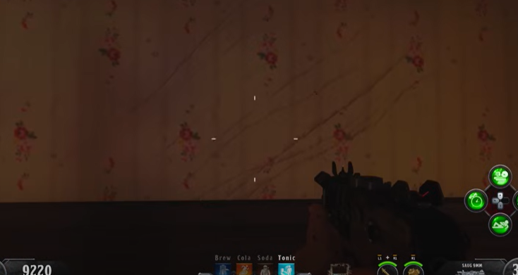\
\
The wallpaper wil be scratched. Bring a slamming Brutus up the stairs to get him to slam the ground. A slamming Brutus will spawn on round 17 if you shield blast the dials and enter 666 into it. Once slammed, Brutus will disappear and the wall will open. In the room grab the red light on the table.\
\
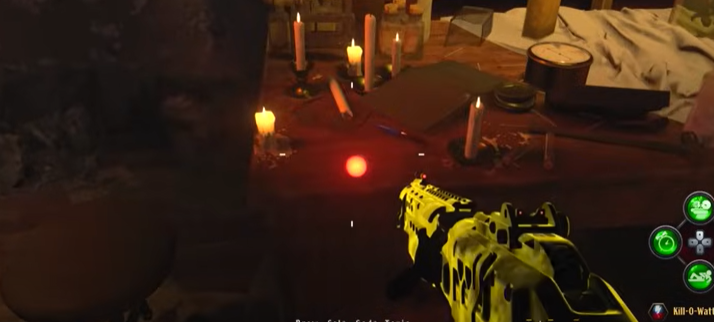\
\
Interact with the power switch in the center of the room. Place the picked up red light on the map in the spawn room.\
\
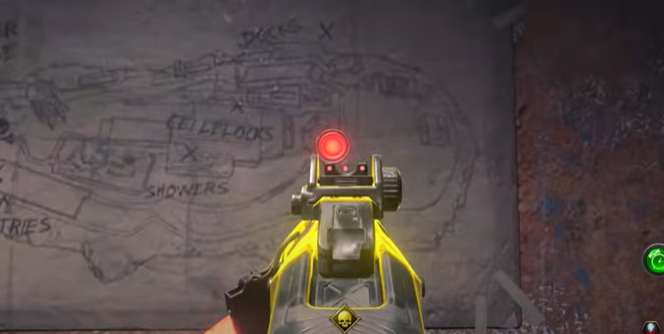\
\
Interact with the Kronorium lying on the floor.\
\
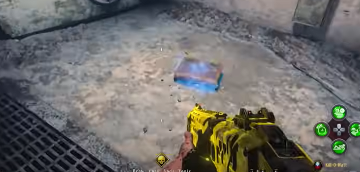\
\
A bird will take the Kronorium and fly away.

### Step 3:
Using the shield run around the map with it out and listen for a bird chirping. When you hear it go into spectral vision to locate the bird and blast it with the shield. There are too many locations to track so you must check the whole map. This must be done three times in three seperate rounds. Now you must listen for the bird for a fourth time on a fourth round. The only problem is that you cant see the bird even in spectral vision. Once you hear the bird you must try to look at the bird with spectral vision even though you can't hear it. You will know you're looking directly at it if you hear the warden crying. Note where that is then go input the number 872 in the dials to spawn in a zombie blood. In zombie blood and in specral vision you can see the bird. Do not blast the bird but throw your Hell's Retreiver at it to drop the Kronorium, when it falls to the ground, pick it up. If the bird flies away try again on the next round, likley at a new location.

### Step 4:
Interact with the warden's corpse in his secret room. Interact with the Kronorium to flip its pages. Go into spectral vision and input the number displayed on the Kronorium into the dials to activate the lighthouse. This will start one of five challenges. You must complete all five but they can be in any order. The challenge begins when you go to the location the lighthouse is lighting up and go into spectral vision. You will see a red portal, shield blast it to begin the challenge. When the challenge it complete a red light will be dropped that must be put onto the map in spawn just like before, this can be done after each challenge or when they are all done. When you pick up a red light from competing a challenge you must go back to the warden's corpse, interact and input the code displayed to reactivate the lighthouse and move on to the next challenge.

#### All challenge locations

##### Power house:
Go to the second power room, interact with this machine:\
\
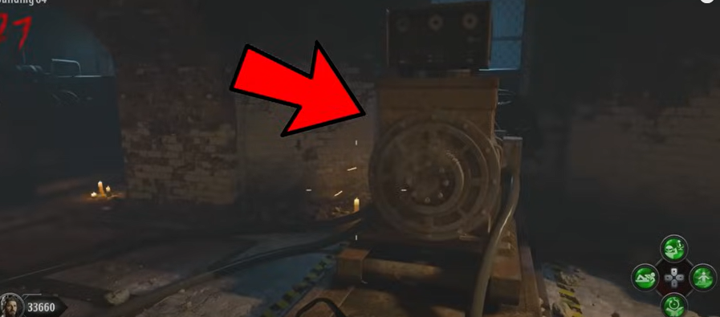\
\
One of the six machines in the room will light up.\
\
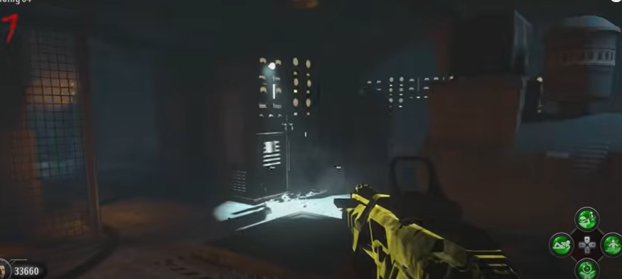\
\
When the light turns off interact with it to continue. Now two new machines will light up, in a certain order interact with those two in the correct order. Then three, four, and five. Once done, three machines will light up at the same time note what little symbols are on the sticky notes attachted to the machines that lit up. Pick up a punch card on the self in that room.\
\
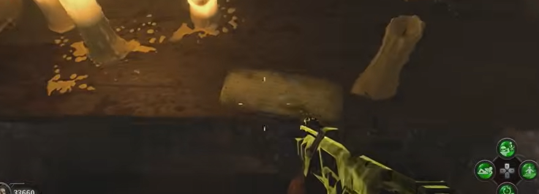\
\
In spawn room, upstairs, put the punch card into this machine:\
\
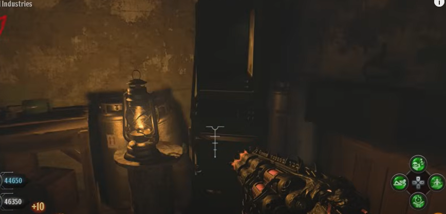\
\
This will turn on several screens with the same symbols from simon says in that room. Interacting with any screen will present a different symbol. Take note of the symbols given by the three screens that had the lit up symbols from before. Those new symbols will be on sticky notes in the power house. In spectral vision there is a ghost trying to flip levers associated with each new symbol. When he is at a symbol matching with the lit up symbols from before shield blast him. Once you blast him at all three symbols he will drop the red light. If you fail, start over.

##### Showers:
Interact with the ghost next to the red portal. This will begin a lockdown in the showers. A ring of fire will spawn in, everyone must stand in it and kill zombies. Don't leave the circle, it will eventually dissapear or move. If it moves go to it and repeat, if it disappears interact with the ghost. The ghost will drop the red light and the lockdown will end.

##### Docks:
In the wardens office, there is a Morse code tapper:\
\
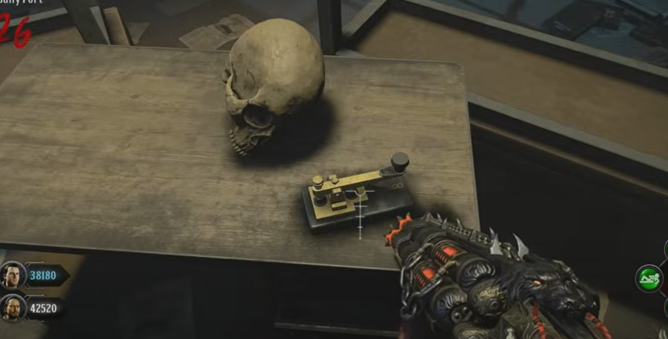\
\
Throguh trial and error, find the correct code of ten inputs. Interacting with the tapper for half of a second is a dot and three seconds for a dash. An incorrect input will cause the warden to laugh and the code will be reset. The code will not change so you must remeber what input works in what order. Once ten correct inputs are input in a row kill a zombie in this room of the infirmary:\
\
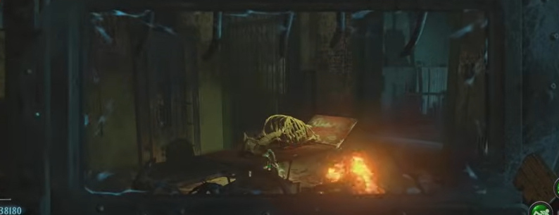\
\
Go into spectral vision to see a ghost. Shield blast him. Kill zombies near the ghost, this will get the ghost to follow you. Bring him to the docks (recommend using the gondola), once he is brought to the red portal he will drop the red light.

##### New industries:
Go to the library, kill a zombie in there. Shield blast a ghost in the library. He will then start to head to new industries. Try to slow him down by body blocking him. While the ghost is visible key drain him to turn him red. This will take a very long time so try to slow him down, if he turns invisible shield blast him and continue draining him, eventually you will no longer have to blast him to see him. When he has turned as red as possible use the trap in new industries to kill him.\
\
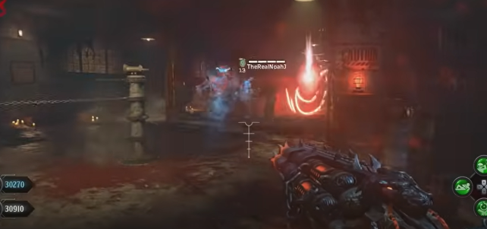\
\
The ghost will drop the red light when killed.

##### Michigan Avenue:
Kill a zombie in the cafeteria. Shield blast the ghost in the cafeteria. He will start to make his way through the prison. Loads of zombies will try to kill the ghost. Defend the ghost, he will start to glow red when taking a lot of damage. When the ghost gets to the red portal he will drop the red light.

### Step 5:
Interact with the warden's corpse in his secret room. When you get out of your cell, pick up you loadout from the bag on the floor. Go through the prison, until you see the warden, keep going. Enemies will start to spawn in, run across the catwalk to the spawn area. Watch the warden transform, he will drop a red light. Place the light onto the map.

### Step 6:
Go up the stairs to the door, have the whole team interact with it to go into the bossfight. During the fight get a shield blast loaded and ready. At a certain point a red field with orbs will spawn in. Your team must immediatly run into the field and destroy those orbs in order to not die because it is a wipe attack.\
\
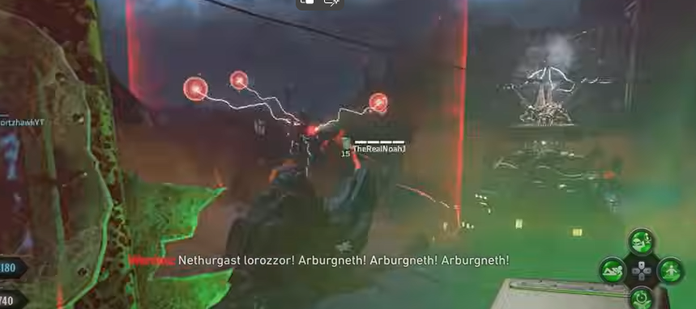\
\
Once destroyed use your shield blast on the dark mechanism here:\
\
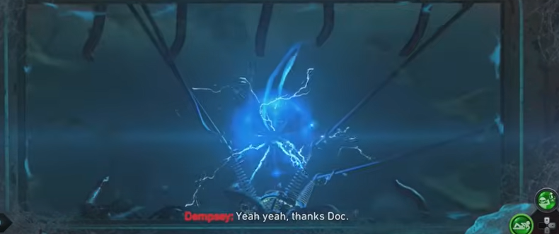\
\
This process will need to be repeated three times where shield blasting turns it blue. Once done three times, whoever is playig as Richtofen must interact with the dark mechanism. That player must now go back into the bossfight in the same way as before.

### Step 7:
gg rip
